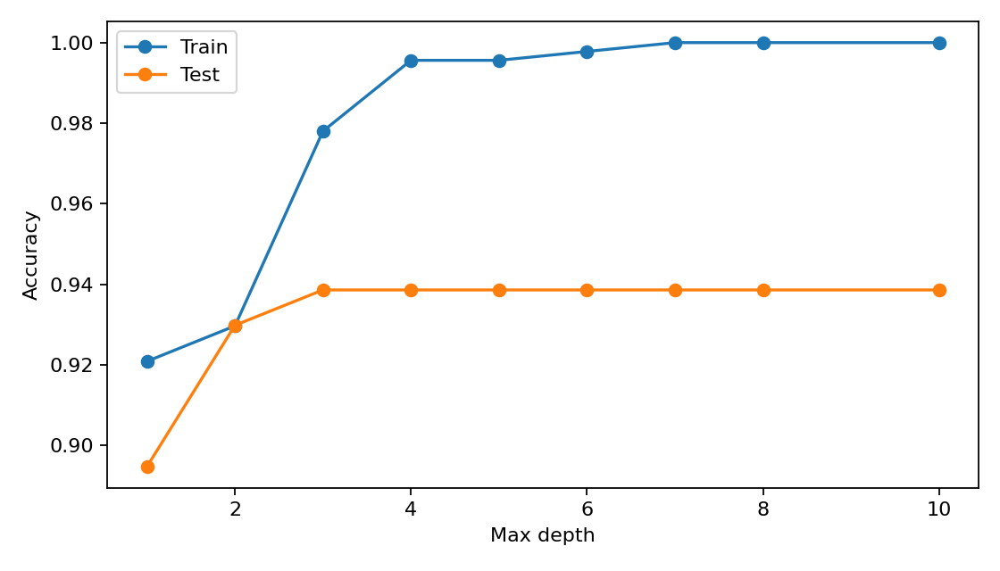
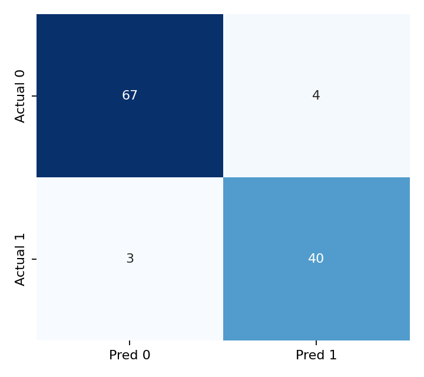
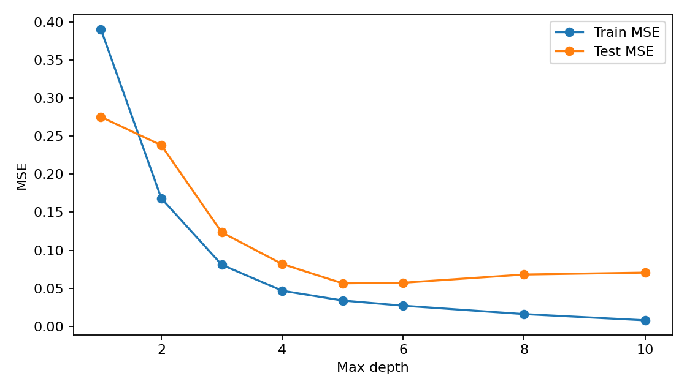
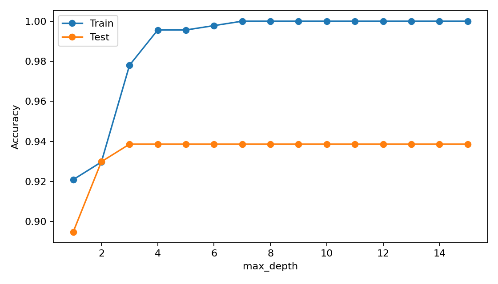
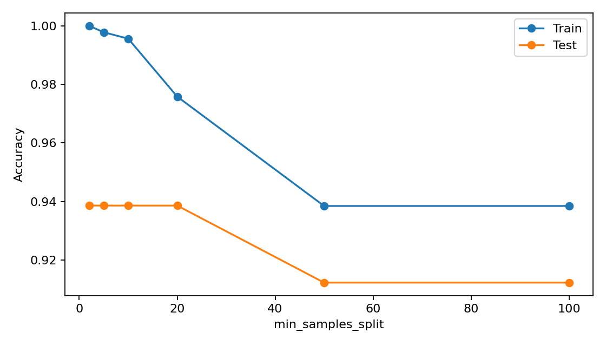
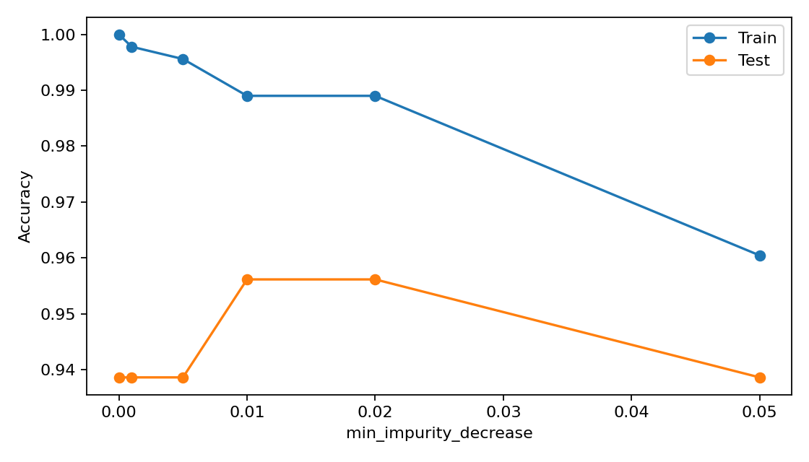
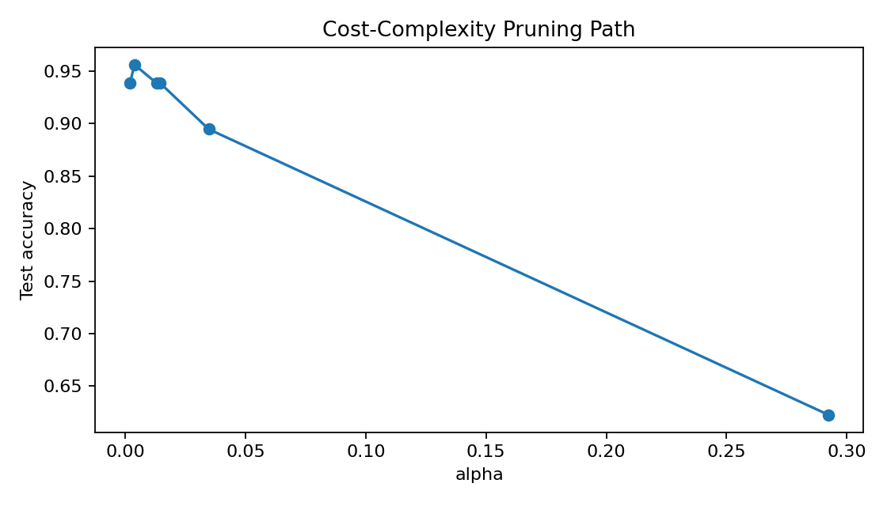
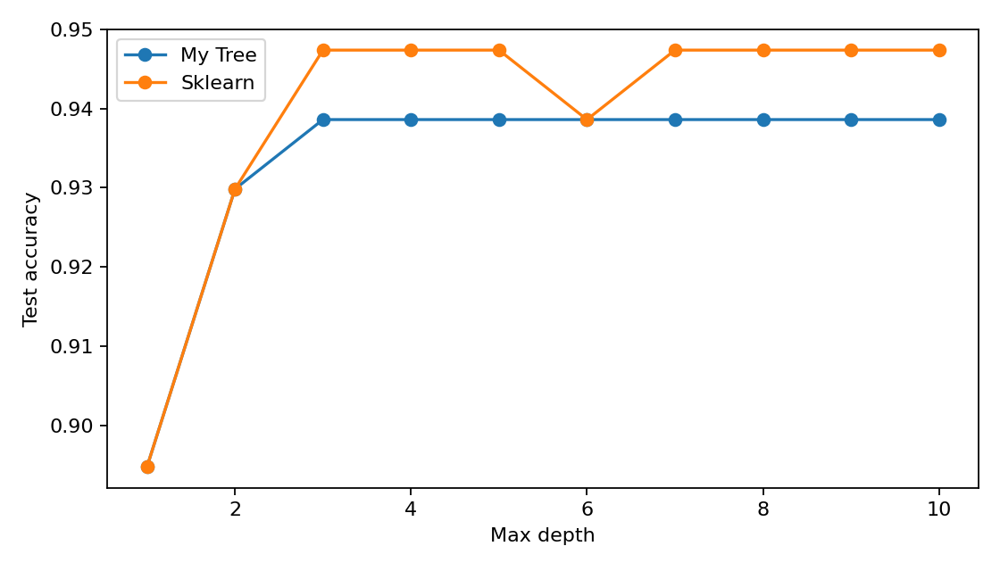

# Decision Tree from Scratch

A complete implementation of the **CART (Classification and Regression Trees)** algorithm built entirely from first principles using only NumPy — no `sklearn` anywhere in the core engine. This project covers the full lifecycle of a decision tree: mathematical derivation, implementation, pruning, failure mode analysis, and benchmarking against `sklearn`, packaged with an interactive Streamlit app.

---


---

## What This Project Demonstrates

- A from-scratch CART engine supporting both **classification** and **regression**
- Gini Impurity, Entropy, and Variance Reduction — each one mathematically derived before being coded
- Cost-complexity pruning using the **weakest-link algorithm**
- A rigorous theoretical foundation — every formula used in `src/` is first derived on paper in the `Theory/` notebooks
- Testing on two datasets with different characteristics: Breast Cancer (continuous features) and Heart Disease (mixed continuous/categorical features)
- Direct benchmarking against `sklearn.tree.DecisionTreeClassifier` for both accuracy and runtime
- An interactive Streamlit app for live predictions, tree visualization, and performance metrics

---

## Repository Structure

```
decision-tree-from-scratch/
│
├── src/
│   ├── cart_nodes.py          # InternalNode / LeafNode data structures
│   ├── impurity.py            # Gini, Entropy, Variance — derived and implemented
│   ├── splitting.py           # Threshold scanning and best-split search
│   ├── decision_tree.py       # Core CART engine (fit, predict, recursion)
│   ├── pruning.py             # Cost-complexity pruning, weakest-link algorithm
│   └── utils.py                # Metrics, confusion matrix, tree printer
│
├── Theory/
│   ├── 01_Entropy_and_InformationGain.ipynb
│   ├── 02_Gini_as_BrierScore.ipynb
│   ├── 03_VarianceReduction_Regression.ipynb
│   ├── 04_BiasVariance_Decomposition.ipynb
│   └── 05_CostComplexity_Pruning.ipynb
│
├── Notebooks/
│   ├── 01_EDA_and_Dataset_Overview.ipynb
│   ├── 02_Preprocessing_Pipeline.ipynb
│   ├── 03_Classification_Tree_Training.ipynb
│   ├── 04_Regression_Tree_Training.ipynb
│   ├── 05_Stopping_Conditions.ipynb
│   ├── 06_Pruning_and_ccp_alpha.ipynb
│   ├── 07_Failure_Mode_Analysis.ipynb
│   └── 08_Benchmark_vs_Sklearn.ipynb
│
├── Data/
│   ├── raw/                    # Original CSVs
│   └── processed/              # Saved .npy arrays for reproducibility
│
├── Results/
│   ├── figures/                # All generated plots
│   └── models/                 # Serialised trained model (best_model.pkl)
│
├── app/
│   ├── app.py                  # Streamlit entry point
│   └── components/
│       ├── prediction_tab.py
│       ├── tree_viz_tab.py
│       └── metrics_tab.py
│
├── requirements.txt
└── README.md
```

---

## Datasets

| Dataset | Features | Type | Task |
|---|---|---|---|
| **Breast Cancer Wisconsin** | 30 | Continuous | Binary classification |
| **Heart Disease (Cleveland)** | 13 | Mixed continuous/categorical | Binary classification |

Using two structurally different datasets validates that the splitting logic generalizes beyond a single clean, continuous-only feature space.

---

## Theoretical Foundation

Every criterion and algorithm used in `src/` is derived mathematically first, in this order:

1. **Entropy and Information Gain** — derived from Shannon's axioms (continuity, symmetry, additivity)
2. **Gini Impurity as Expected Brier Score** — proving Gini is the expected squared probability error
3. **Variance Reduction for Regression Trees** — proving the mean minimizes squared error at a leaf
4. **Bias-Variance Decomposition** — the formal justification for why pruning works
5. **Cost-Complexity Pruning** — full derivation of the weakest-link algorithm

These notebooks live in `Theory/` and are meant to be read before the corresponding `src/` files — the code is a direct translation of the math, not the other way around.

---

## Results

### Classification: Gini vs Entropy, Depth Study



Training and test accuracy across tree depths on the Breast Cancer dataset. The widening gap between curves shows where overfitting begins.

### Confusion Matrix



### Regression: MSE vs Depth



The variance-reduction criterion tested on a synthetic sine-wave regression task shows the same overfitting pattern as classification.

### Stopping Conditions

| max_depth | min_samples_split | min_impurity_decrease |
|---|---|---|
|  |  |  |

### Cost-Complexity Pruning Path



Pruning with a manually selected alpha improved test accuracy over the unpruned tree while reducing the leaf count substantially — a direct demonstration of the bias-variance tradeoff from `Theory/04`.

### Failure Mode Analysis

Four failure modes were deliberately induced and measured on Breast Cancer:

- **Class imbalance** — accuracy looked acceptable, but minority-class recall suffered, showing why accuracy alone is a misleading metric
- **High dimensionality** — 50 pure-noise features were added; the greedy threshold scan's robustness to irrelevant features was tested directly
- **Multicollinearity** — comparing trees trained with and against a redundant correlated feature
- **Small sample size** — a 20-sample tree with no depth limit reached 100% train accuracy but generalized poorly, illustrating classic overfitting

### Benchmark vs Sklearn



At `max_depth=5` on the Breast Cancer test set, this implementation achieves accuracy comparable to `sklearn.tree.DecisionTreeClassifier`, with the expected slowdown in training and inference time due to pure Python/NumPy execution versus sklearn's Cython-optimized backend. Full comparison — including a depth sweep and root-split agreement check — is in `Notebooks/08_Benchmark_vs_Sklearn.ipynb`.

---

## Running the App

```bash
pip install -r requirements.txt
python -m streamlit run app/app.py
```

The app loads a pre-trained model from `Results/models/best_model.pkl` and provides three tabs:

- **Prediction** — adjust feature values with live inputs and get an instant classification, including the leaf's class distribution
- **Tree Visualization** — inspect the trained tree's split structure with an adjustable depth limit
- **Metrics** — accuracy, precision, recall, F1, and a confusion matrix on the held-out test set


---

## License

See `LICENSE` for details.